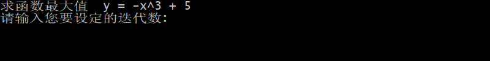
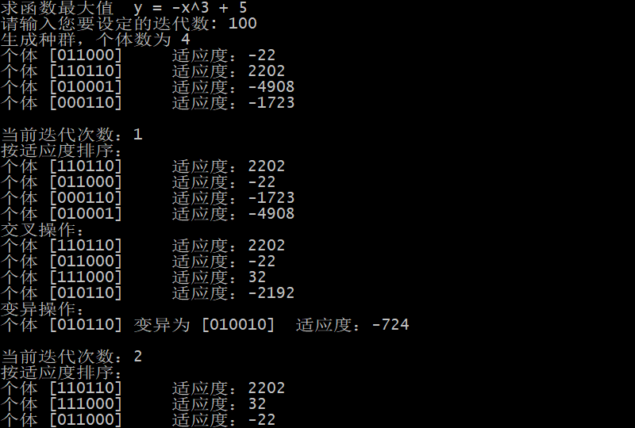
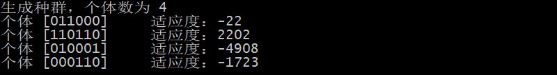
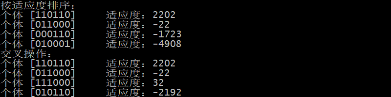
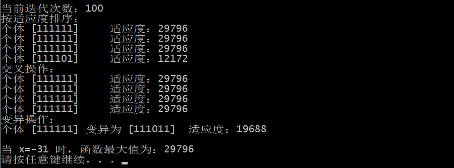

# 遗传算法应用—求函数的最大值

## 1. 算法原理

### (1) 编码以及初始种群的产生

编码采用二进制编码，初始种群采用矩阵的形式，每一行表示一个染色体，每一个染色体由若干个基因位组成。本次实验中，染色体长度为6，前5个二进制构成该染色体的值（十进制），第6个表示该染色体的适应度值。长度越长，表示解空间搜索范围越大。

### (2) 适应度函数

直接以目标函数作为适应度函数,，即每个染色体的适应度值就是它的目标函数值，f(x)=-x^3+ 5。

### (3) 选择算子

初始种群产生后，要从种群中选出若干个体进行交叉、变异，本次实验采用排序法来选择，即每次选择都选出适应度最高的两个个体。

### (4) 交叉算子

采用最简单的单点交叉，交叉点随机产生。

### (5) 变异

采取基因位反转变异法，即 0 变为 1，1 变为 0，要进行变异的基因位的选取也是随机的，变异率设置为 1/3。

### (6) 终止规则

采用迭代数来限制遗传代数。

## 2. 运行结果

(1) 程序运行开始，请输入遗传算法要进行的迭代次数

(2) 迭代次数设置为 100

(3) 生成拥有 4 个个体的随机种群

(4) 将个体按适应度排序，每代挑选出两个适应度最高（函数值最大）的个体，进行交叉

(5) 以 1/3 的概率对个体编码中的一个位进行变异

(6) 经过 100 次迭代，得出结果

